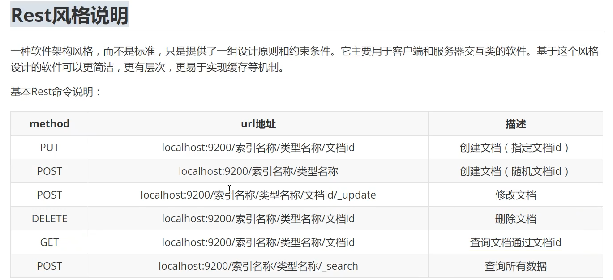

## 官方主页
https://www.elastic.co/cn/elasticsearch/features

## 官方Rest 风格 API 文档
https://www.elastic.co/guide/en/elasticsearch/reference/current/docs.html

## 官方JAVA API 文档
https://www.elastic.co/guide/en/elasticsearch/client/java-rest/current/index.html

## es操作

### 基本rest请求




### 操作示例

#### 创建索引

> 创建一个索引，指定属性的数据类型
>
> ```json
> PUT testdb
> {
>   "mappings": {
>     "properties": {
>       "name": {
>         "type": "text"
>       },
>       "desc": {
>         "type": "keyword"
>       }
>     }
>   }
> }
> ```

#### PUT 操作

> PUT 操作，如果没有索引，则创建索引。如果没有类型，则创建类型，如果没有ID则创建指定ID
> PUT 操作更新，当索引、类型、ID都存在时，则会执行更新操作，并且这个更新操作是将原来的所有数据都清空，然后将下面的这些数据添加到文档中。
> 所以很多时候，如果我们要进行单个属性的更新时，我们会使用POST 方法进行更新操作。
>
> ```json
> PUT /kuangshen/user/1
> {
>   "name": "狂神说Java",
>   "age": 23,
>   "desc": "一顿操作猛 如虎，一看工资2500",
>   "tags": ["技术宅", "温暖", "直男"]
> }
> ```
>
> ```json
> PUT /kuangshen/user/2
> {
>   "name": "张三",
>   "age": 3,
>   "desc": "法外狂徒",
>   "tags": ["交友", "旅游", "渣男"]
> }
> ```
>
> ```json
> PUT /kuangshen/user/3
> {
>   "name": "李四233",
>   "age": 30,
>   "desc": "mmp，不知道如何形容",
>   "tags": ["技术宅", "温暖", "直男"]
> }
> ```
>
> ```json
> PUT /kuangshen/user/4
> {
>   "name": "狂神说前端",
>   "age": 3,
>   "desc": "一顿操作猛 如虎，一看工资2500",
>   "tags": ["技术宅", "温暖", "直男"]
> }
> ```

#### 查看文档

> 查看指定文档
>
> ```json
> GET /suyh/user/1
> ```

#### 删除文档

> 删除指定文档
>
> ```json
> DELETE /suyh/user/1
> ```

#### HTTP简单搜索

> ```json
> GET kuangshen/user/_search?q=name:狂神说
> ```

#### JSON搜索

##### 指定字段进行查询

> 查询，指定字段进行匹配
>
> 类比: SELECT * FROM kuangshen WHERE name LIKE '%说%'
>
> 但是 match 只能每次匹配一个属性，不能做 match: { "name": "说", "age": 23 }
>
> 这个是语法错误，不支持
>
> ```json
> GET kuangshen/user/_search
> {
>   "query": {
>     "match": {
>       "name": "说"
>     }
>   }
> }
> ```
>
> ```json
> GET kuangshen/user/_search
> {
>   "query": {
>     "match": {
>       "name": "狂神"
>     }
>   }
> }
> ```
>
> ```json
> GET kuangshen/user/_search
> {
>   "query": {
>     "match": {
>       "name": "java"
>     }
>   }
> }
> ```

##### 过滤要查询的字段

> 类比: SELECT name, desc FROM kuangshen WHERE name LIKE '%狂神%'
>
> ```json
> GET kuangshen/user/_search
> {
>   "query": {
>     "match": {
>       "name": "狂神"
>     }
>   },
>   "_source": ["name", "desc"]
> }
> ```

##### 排序

> 根据指定字段进行排序
>
> 同时这里指定了排序功能，则返回值里面就不会有_score 的值了
>
> 类比：SELECT * FROM kuangshen WHERE name LIKE '%狂神%' ORDER BY age;
>
> ```json
> GET kuangshen/user/_search
> {
>   "query": {
>     "match": {
>       "name": "狂神"
>     }
>   },
>   "sort": [
>     {
>       "age": {
>         "order": "desc"
>       }
>     }
>   ]
> }
> ```

##### 分页查询

> ```json
> GET kuangshen/user/_search
> {
>   "query": {
>     "match": {
>       "name": "狂神"
>     }
>   },
>   "sort": [
>     {
>       "age": {
>         "order": "desc"
>       }
>     }
>   ],
>   "from": 0,
>   "size": 1
> }
> ```

#### 复杂查询

##### 多条件查询

###### and

> must: and
>
> 类比： select * from kuangshen where name like '%狂神%' and age = 3
>
> ```json
> GET kuangshen/user/_search
> {
>   "query": {
>     "bool": {
>       "must": [
>         {
>           "match": {
>             "name": "狂神"
>           }
>         },
>         {
>           "match": {
>             "age": 3
>           }
>         }
>       ]
>     }
>   }
> }
> ```

###### or

> should: or
>
> 类比： select * from kuangshen where name like '%说前端%' or age like '%3%'
>
> ```json
> GET kuangshen/user/_search
> {
>   "query": {
>     "bool": {
>       "should": [
>         {
>           "match": {
>             "name": "说前端"
>           }
>         },
>         {
>           "match": {
>             "age": 3
>           }
>         }
>       ]
>     }
>   }
> }
> ```

##### 过滤器, 范围查询

###### filter

> 类比： select * from kuangshen where name like '%狂神%' and (age >= 10 and age <= 25)
>
> ```json
> GET kuangshen/user/_search
> {
>   "query": {
>     "bool": {
>       "must": [
>         {
>           "match": {
>             "name": "狂神"
>           }
>         }
>       ],
>       "filter": {
>         "range": {
>           "age": {
>             "gte": 10,
>             "lte": 25
>           }
>         }
>       }
>     }
>   }
> }
> ```

###### tags 里面的多条件匹配

> tags 里面多个条件匹配，可以直接用空格隔开就可以了
>
> ```json
> GET kuangshen/user/_search
> {
>   "query": {
>     "match": {
>       "tags": "男 技术"
>     }
>   }
> }
> ```

#### 精确匹配

> term，直接查询精确的分词
>
> match, 会使用分词器解析！（先分析文档，然后再通过分析的文档进行查询）
>
> 两个类型
>
>  text: 可以被分词器解析
>
> keyword: 不可以被分词器解析
>
> ```json
> PUT testdb
> {
>   "mappings": {
>     "properties": {
>       "name": {
>         "type": "text"
>       },
>       "desc": {
>         "type": "keyword"
>       }
>     }
>   }
> }
> ```
>
> 
>
> ```json
> PUT testdb/_doc/1
> {
>   "name": "狂神说Java name",
>   "desc": "狂神说Java desc"
> }
> ```
>
> ```json
> PUT testdb/_doc/2
> {
>   "name": "狂神说Java name",
>   "desc": "狂神说Java desc2"
> }
> ```
>
> 没有走分词器，将字符串当成一个整体进行匹配
>
> ```json
> GET _analyze
> {
>   "analyzer": "keyword",
>   "text": "狂神说Java name"
> }
> ```
>
> 分词器
>
> ```json
> GET _analyze
> {
>   "analyzer": "standard",
>   "text": "狂神说Java name"
> }
> ```
>
> 完全匹配，keyword 类型会将整体进行匹配
>
> 如下，desc 有两个一个是"狂神说Java desc" 另一个是"狂神说Java desc2"
>
> 而这里只匹配到了一条数据，这就是这里所说的完全匹配。没有走分词器
>
> ```json
> GET testdb/_search
> {
>   "query": {
>     "term": {
>       "desc": "狂神说Java desc"
>     }
>   }
> }
> ```
>
> ```json
> PUT testdb/_doc/3
> {
>   "t1": "22",
>   "t2": "2020-4-6"
> }
> 
> ```
>
> ```json
> PUT testdb/_doc/4
> {
>   "t1": "33",
>   "t2": "2020-4-7"
> }
> ```
>
> ```json
> GET testdb/_search
> {
>   "query": {
>     "bool": {
>       "should": [
>         {
>           "term": {
>             "t1": "22"
>           }
>         },
>         {
>           "term": {
>             "t1": "33"
>           }
>         }
>       ]
>     }
>   }
> }
> ```
>
> 

#### 高亮

##### 默认高亮标签

> ```json
> GET kuangshen/user/_search
> {
>   "query": {
>     "match": {
>       "name": "狂神"
>     }
>   },
>   "highlight": {
>     "fields": {
>       "name": {}
>     }
>   }
> }
> ```
>
> 

##### 自定义高亮标签

> ```json
> GET kuangshen/user/_search
> {
>   "query": {
>     "match": {
>       "name": "狂神"
>     }
>   },
>   "highlight": {
>     "pre_tags": "<p class='key' style='color:red'>",
>     "post_tags": "</p>", 
>     "fields": {
>       "name": {}
>     }
>   }
> }
> ```
>
> 

---


## kibana 配置

### 配置

#### 汉化

> 所在文件位置
>
> `kibana-7.6.1-windows-x86_64\x-pack\plugins\translations\translations/zh-CN.json`

#### 配置

> 所在文件位置
>
> `kibana-7.6.1-windows-x86_64\config/kibana.yml`
>
> ```yml
> i18n.locale: "zh-CN"
> ```


